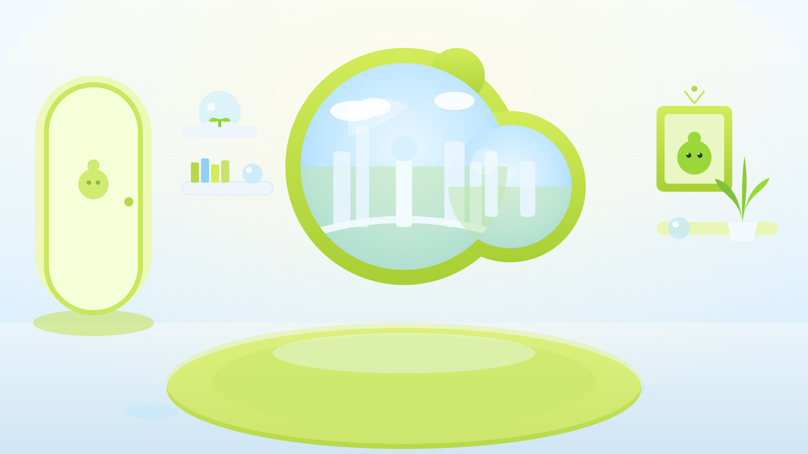

# 💚 TamaLove

Un petit **Tamagotchi web en Three.js**. Sa particularité : la créature ne mange
pas de nourriture classique — **elle se nourrit de l'amour qu'on lui porte**.
Une seule jauge, l'**Amour**, qui s'estompe si on l'ignore et remonte quand on
prend soin d'elle.



## ▶️ Lancer le jeu

Le jeu utilise des modules ES et charge des textures : il faut un petit serveur
local (ouvrir `index.html` en `file://` ne marchera pas à cause du CORS).

```bash
# au choix — depuis le dossier du projet :
npm start                 # → http://localhost:5173  (python3 -m http.server)
# ou
python3 -m http.server 5173
# ou
npx serve -l 5173 .
```

Puis ouvre **http://localhost:5173** dans un navigateur récent.

## 🎮 Comment jouer

| Action | Comment | Effet |
|---|---|---|
| **Caresser** | Clique / glisse sur la créature | Petit gain + rebond (squash) |
| **Câlin** 🤗 | Bouton (cooldown) | Gros gain d'amour |
| **Complimenter** 💬 | Bouton | Gain moyen + mot doux flottant |
| **Jouer** 🎈 | Bouton | Lance le mini-jeu « attrape les cœurs » |

La jauge d'**Amour** décroît lentement. Selon son niveau, la créature change
d'humeur (rayonnante → contente → mélancolique → en manque d'affection), ce qui
se voit sur sa teinte, son animation, ses particules et son petit texte d'humeur.
Il n'y a **pas de game over** : même triste, on peut toujours la consoler.

### Ce qui donne de la profondeur

- **Lien & évolution** : un niveau de *Lien* permanent monte avec le temps et les
  soins ; la créature **évolue** par paliers (taille + halo).
- **Elle est vivante** : elle **réclame** parfois un câlin (bulle de pensée, bonus
  si tu réponds), **suit ton curseur du regard**, et **dort la nuit** (cycle
  jour/nuit basé sur l'heure réelle).
- **Mini-jeu & surprises** : attrape-cœurs chronométré, **cœurs dorés** surprises,
  petits **succès** et **série de visites** quotidienne.
- **Sons & haptique** : petits sons doux (WebAudio, générés), vibration au câlin,
  bouton 🔊 pour couper le son.

Le nom, l'amour, le lien, les jours ensemble, la série, les succès et les stats
sont **sauvegardés** (localStorage). Au retour, le temps écoulé est pris en
compte (*« il t'attendait »*) sans jamais vider complètement la créature.

## 🗂️ Structure

```
index.html            page + interface (HUD, styles, écran de chargement)
src/
  main.js             scène Three.js, boucle, interactions, UI, systèmes de jeu
  creature.js         créature (shader d'humeur + wobble jelly, idle, regard, sommeil, évolution)
  hearts.js           particules de cœurs (textures générées au runtime)
  minigame.js         mini-jeu attrape-cœurs + cœur doré (overlay DOM)
  audio.js            sons doux générés en WebAudio (aucun fichier)
  floatingText.js     mots doux flottants
  storage.js          persistance localStorage (amour, lien, jours, succès…)
  config.js           toutes les constantes de gameplay & direction artistique
assets/
  tamagogo.png        sprite du personnage (PNG transparent)
  room.png            décor de fond (la chambre)
tools/                (dev) génération de placeholders SVG + smoke-test
```

## 🖼️ Remplacer les images

Le jeu charge `assets/tamagogo.png` (perso, PNG **transparent**) et
`assets/room.png` (fond). Pour utiliser tes propres images, **remplace ces
fichiers** — aucun code à modifier :

- Le perso est rendu sur un plane avec `LinearFilter` (net, non pixel-art). Au
  chargement, le jeu **mesure la boîte du corps visible** (via le canal alpha)
  pour le dimensionner et le poser correctement sur le tapis, quelle que soit
  la marge transparente autour du sprite.
- Le fond est cadré en *cover* automatiquement et s'adapte à la fenêtre.

Pour un autre nom de fichier perso, change le chemin dans `src/main.js`
(`texLoader.load('./assets/…')`).

Les assets fournis ont été générés à partir de SVG (`tools/svg/`). Pour les
régénérer : `npm run assets` (nécessite Playwright / Chromium).

## 🛠️ Technique

- **Three.js** (r160, via import map CDN), un seul projet web lançable localement.
- Boucle `requestAnimationFrame` avec **delta time** → animations & jauge
  indépendantes du framerate.
- Post-process léger : **bloom subtil** (plus marqué sur les états heureux) +
  **vignette** chaleureuse.
- **Parallaxe** entre le fond et le perso au mouvement de la souris.
- **Responsive** : cadrage et échelle recalculés au redimensionnement.
- Chargement des textures géré par un `LoadingManager` avec écran de chargement.
